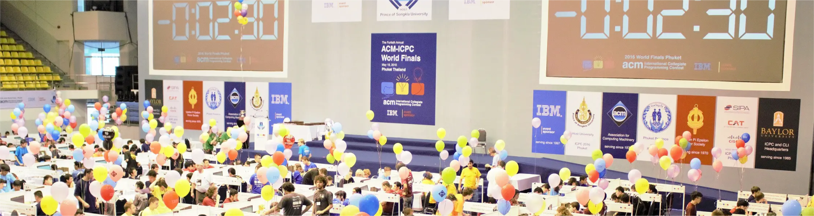

# Competitive Programming Exercises/Problems Solving



## Simple base code

```cpp
// Include all libs is not a good practice,
// but it save writing time during the programming competition
#include<bits/stdc++.h>

using namespace std;

int main()
{
    /*
     ===    Fast-io
            when a exercise have many I/O, the
            TLE could happen in the start of problem

     - These command will works against these TLE problems caused by a bunch of I/O.
     - Using scanf/printf instead CIN and COUT could work also.
     */
    ios_base::sync_with_stdio(false);
    cin.tie(NULL);
}
```

## Complex base code

```cpp
#include <bits/stdc++.h>

#define uDEBUG false
#define debugf if (uDEBUG) printf
#define MAXN 200309
#define MAXM 900009
#define ALFA 256
#define MOD 1000000007
#define INF 0x3f3f3f3f
#define INFLL 0x3f3f3f3f3f3f3f3f
#define EPS 1e-9
#define PI 3.141592653589793238462643383279502884
#define FOR(x,n) for(int x=0;(x)<int(n);(x)++)
#define FOR1(x,n) for(int x=1;(x)<=int(n);(x)++)
#define REP(x,n) for(int x=int(n)-1;(x)>=0;(x)--)
#define REP1(x,n) for(int x=(n);(x)>0;(x)--)
#define pb push_back
#define pf push_front
#define fi first
#define se second
#define mp make_pair
#define sz (x) int (x.size())
#define all (x) x.begin(),x.end()
#define mset (x,y) memset(&x,(y),sizeof(x))
#define ____ ios_base::sync_with_stdio(0);cin.tie(0);

using namespace std;

typedef long long ll;
typedef unsigned long long ull;
typedef long double ld;
typedef unsigned int uint;
typedef vector<int> vi;
typedef pair<int,int> ii;

int main() { ____
    // Code here...

    return 0;
}
```

## Input Common Cases:

Read until finish:

```cpp
    int a, b, c;

    while(cin >> a >> b)
    {
        c = a + b;
        cout << c << endl;
    }
```

Number of predetermined test cases:

```cpp
    int t, a, b, c;
    cin >> t;
    while(t--)
    {
        cin >> a >> b;
        c = a + b;
        cout << c << endl;
    }
```

##

## Some possible errors:

- **[TLE]** Time Limit Exceed: It happen when you algorithm exceed the time of execution. The main problem with this error is that it will not allow you to know that your solution would reach to correct solution or not;

- **[PE] or [WA]** Presentation Error: Some judges do not have Presentation Error well implemented, e.g. if you print more `\n` or more space than necessary, it could return Wrong Answer instead Presentaton Error;

- **[WA]** Wrong Answer: It happen when the answer for the tests is wrong, or a possible (PA).

## Table of Exercises

| Type        | Description                         | Problem Question Link                                                       | Solving                            |
| ----------- | ----------------------------------- | --------------------------------------------------------------------------- | ---------------------------------- |
| Stack       | Stack                               | [uri1068](https://www.beecrowd.com.br/judge/en/problems/view/1068)          | [C++](./uri/1068/1068.cpp)         |
| Queue       | The Stock Span Problem              | [letcode406](https://leetcode.com/problems/queue-reconstruction-by-height/) | [C++](./letcode406/406.cpp)        |
| Logic       | Logic + STL (max)                   | [uva11799](./uva/11799/)                                                    | [C++](./uva/11799/11799.cpp)       |
| Stack, OOP  | Logic + STL (Stack) and OOP (Class) | [uva12015](./uva/12015/)                                                    | [C++](./uva/12015/12015.cpp)       |
| Logic, Math | Logic + Mathematics                 | [uva10812](./uva/10812/)                                                    | [C++](./uva/10812/10812.cpp)       |
| Logic, Math | Logic + Mathematics                 | [uva10346](./uva/10346/)                                                    | [C++](./uva/10346/10346.cpp)       |
| Logic       | Logic                               | [codeforces1220A](./codeforces1220A/)                                       | [C++](./codeforces1220A/1220A.cpp) |
| Logic       | Logic                               | [atcoder_agc004](./atcoder_agc004/)                                         | [C++](./atcoder_agc004/agc004.cpp) |
