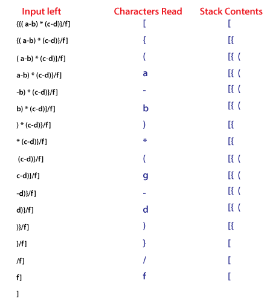

# 1068 - Solving

###### Parenthesis Balance I

1. [The Algorithm](#the-algorithm)
2. [The Code Implementation](#the-code-implementation)
3. [References](#references)

## The Algorithm

To solve this question is used the **Stack** data structure, this algorithm is similar with the idea of to check the HTML or a Code syntax, for example:

> This image was get from https://www.javatpoint.com/applications-of-stack-in-data-structure

The image above is a good example, very near about what the algorithm in cpp do.

## The Code Implementation

[Click here to see the algorithm in cpp](./1068.cpp)

## References

- [Stack cpp-docs](https://en.cppreference.com/w/cpp/container/stack)
- [Getline loop tip](https://stackoverflow.com/questions/15800705/c-whilegetline-doesnt-get-the-first-line-of-file)
- [Getline cpp-docs](https://en.cppreference.com/w/cpp/string/basic_string/getline)
- [Cin loop](../)
