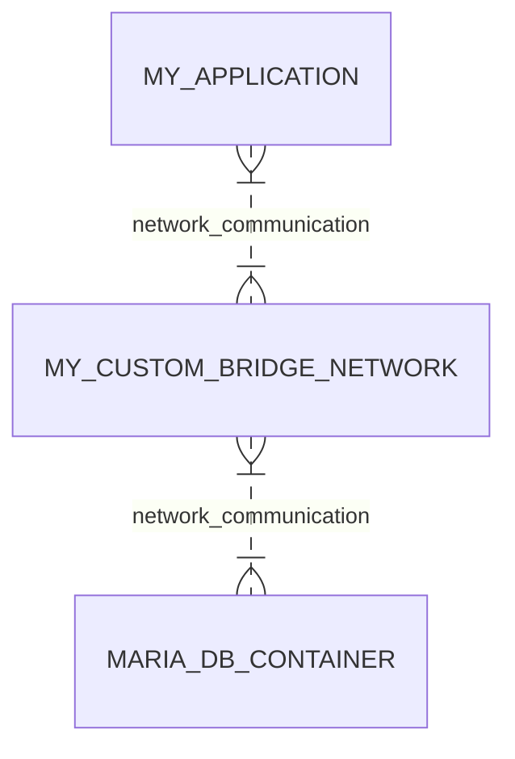

# Docker Networks

## Getting Started


1. [Bridge, Default Docker Networks and User-Defined Network](#bridge-default-docker-networks-and-user-defined-network)
2. [How works None Network](#how-works-none-network)
3. [How works Host Network](#how-works-host-network)
4. [Simple use example diagram](#example)

### Bridge, Default Docker Networks and User-Defined Network

If not set the network, the docker will use the default network:

Run `docker inspect CONTAINER_ID`, in the response, will have:

```
...
"Networks": {
    "bridge": {
        ...
    }
}
```

It is not a problem if you want that all the containers use the same networking, but if you want to isolate the network it is a problem.

Use `docker network ls` to list the default docker networks.

```
NETWORK_ID  NAME        DRIVER      SCOPE
BRIDGE_ID   bridge      bridge      local
HOST_ID     host        host        local
NONE_ID     none        null        local
``` 

But if you want to communicate container A with B, both in the same network could be a problem, because the IP is not a guarantee, and we cant to use the CONTAINER_NAME when the networking is the default.

A way to solve it is:

1. Create a new bridge network `docker network create --driver bridge my_bridge_net`
2. Create a container with a name and this network `docket run -it --name ubuntu001 --network my_bridge_net ubuntu bash`

Now if inspect this new container, it will return:

```
...
"Networks": {
    "my_bridge_net": {
        ...
    }
}
```

3. Create other container just to recieve the ping with sleep 1d to not stop the container after creation `docket run -d --name ubuntu_pong --network my_bridge_net ubuntu sleep 1d` 
4. In the bash of **ubuntu001** container after run `apt-get update` and `apt-get install iputils-ping -y` is possible to run the command `ping ubuntu_pong`.

It works well because the user-defined bridges provide this association. [Read more about User-defined bridges provide automatic DNS resolution between containers in the documentation.](https://docs.docker.com/network/bridge/#differences-between-user-defined-bridges-and-the-default-bridge).

### How works None Network

None: is a complete network isolated containter, this container haven't a network interface.

To create a docker container with none networks is necessary to set the flag `--network none` when run.

### How works Host Network

Host: uses the host network in the container, so if you run the Dockerfile created in [Images explaning](../Images/). When the docker starts, and run the npm start, is possible to access the `localhost:port` without mapping the ports.

Then we do not need to use the flag `-p` to mapping the ports, just running the command below will work the access, because the Docker Container Network is not isolated of the Host Network (Docker Container now is using the same network of the host machine)

```
docker run -d --network host rickelmedias/app-node:1.0
```

### Example

In this chart below is possible to see a example of application, where I could use two containers in the same custom networking, and a good advantage in this custom networks is that our container (MY_APPLICATION) can access the database container by name (MARIA_DB_CONTAINER).

1. MY_APPLICATION config file:
```
    {
        "databaseConfig": {
            "host": "MARIA_DB_CONTAINER",
            "database": "db_name"
    }
```


