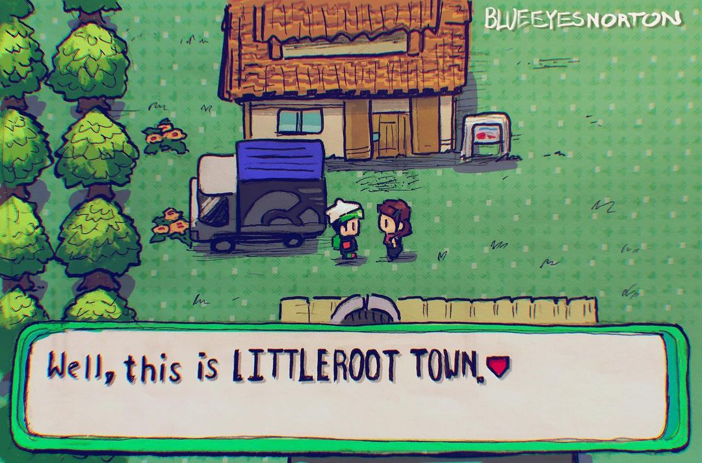

> Choose your language click on the flag:

    
    

  

# Iniciando

Littleroot é um repositório de um Engenheiros de Computação. Abrange conteúdos de matemática, ciência da computação e tecnologia em geral.

O nome "Littleroot" tem um significado importante, combinando as palavras "Little" (pequeno) e "Root" (raiz). Isso simboliza uma cidade pequena, porém fundamental, um lugar onde tudo começa. Este repositório compartilha uma essência semelhante, representando um ponto de partida para aprender desde o início, abrangendo conteúdos essenciais e fundamentais. Assim como em Littleroot, onde treinadores embarcam em sua jornada Pokémon e, por fim, se tornam campeões, este repositório guia os aprendizes desde suas fases iniciais como treinadores até seu objetivo final de domínio.

Aqui, você pode me acompanhar em minha jornada de aprendizado em Engenharia de Computação!

# Tabela de Conteúdos

| Tema                                                  | Descrição                                                 |
| ----------------------------------------------------- | --------------------------------------------------------- |
| [Maratona de Programação](./competitive-programming/) | Aulas, exercicios e guias sobre a maratona de programação |
| [Computação](./computing/)                            | Outros tópicos de computação.                             |
| [Matemática](./mathematics/)                          | Outros tópicos de matematica.                             |

   

# Getting started

Littleroot is a repostory of a Computer Engineer. It covers content from mathematics, computer science, and technology in general.

The name "Littleroot" holds a significant meaning, combining the words "Little" and "Root." It symbolizes a small yet foundational city, a place where everything begins. This repository shares a similar essence, representing a starting point to learn from scratch, covering essential and fundamental content. Just like Littleroot, where trainers embark on their Pokémon journey and ultimately become champions, this repository guides learners from their initial stages as trainers to their ultimate goal of mastery.

Here, you can join me on my journey of learning Computer Engineering!

# Table of Contents

Here you can access my contents easy filtering by subject type.

| Subject                                               | Description                                                 |
| ----------------------------------------------------- | ----------------------------------------------------------- |
| [Competitive Programming](./competitive-programming/) | Classes, exercises and guides about competitive programming |
| [Computing](./computing/)                             | More computing topics.                                      |
| [Mathematics](./mathematics/)                         | More mathematics topics.                                    |
